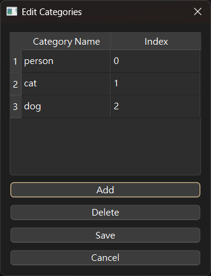

本專案可對影像, 影片畫框  
用於作出object detection的影像訓練dataset  
可使用ultralytics版的yolo model來自動偵測, 或是表現VOC的框的資訊


# 簡易Use Case [2025.3.29]
1. Menu: File -> Open Folder, 開啟一個需要圖片畫框的資料夾
2. Menu: Ai -> Use default model, 下載預設model並偵測影像, 應可偵測人物, 貓, 車等物體
3. Save: 將框調整過後即可存成VOC格式的.xml檔案, 或使用`Auto Save`來自動儲存(注意原先的xml檔案會被覆蓋)
4. Menu: Convert -> Edit Categories  編輯映射的分類, 可自行設定編號, 讓VOC的物件名稱轉成yolo的數字編號, 如下
  
5. Menu: Convert -> VOC to YOLO  將xml檔案轉成yolo可訓練的標籤檔(但對應的yolo數字編號需先設定, 請看第4項)
6. 即可透過顯卡或雲端服務來訓練yolo模型, 如果是想用ultralytics來訓練, 可以參考以下設定檔
```
train: ../train/images
val: ../train/images

nc: 3
names: 
  0: person
  1: cat
  2: dog
```

# 功能一覽
## 畫框
- 讀取.pt model, 可偵測影像並畫框
  - Menu: Ai -> Use default model 自動從網路上下載yolov8n.pt並使用, 可快速體驗影像偵測功能
  - Menu: Ai -> Select Model 可選擇.pt model, 必須是`Ultralytics` lib能夠使用的model
  - Menu: Ai -> Detect 可偵測影像並畫框
  - Menu: Ai -> Auto Detect 自動偵測並畫框. 下方有快捷鍵
- 如果圖檔旁有同名的VOC標籤檔, **則優先作為框的資訊**
- 如果沒有上述兩種方法, 則需要手動按左鍵畫框, 信心值為100%
- 按右鍵可以刪除框, 框重疊時, 後來畫的框會先被刪
- 畫完框, 框角可以調整大小, 每次focus的框都會暫時變黃色
- 按下小寫的`L`來設定框的名稱, 只對之前focus的框做更改
  - Menu: Edit -> Edit Label 也能改框名
- 預設label種類名稱[設定檔](./config/settings.yaml), 按下數字鍵可以直接切換label名稱, 只對之前focus的框做更改

## FileSystem相關
- 開啟資料夾來瀏覽影像或影片
  - Menu: File -> Open Folder
  - Menu: File -> Open File By Index   可選取該資料夾的第N個影像或影片
- 儲存相關
  - Menu: File -> Save  儲存框的資訊. 下方有快捷鍵
  - Menu: File -> Auto Save  會在瀏覽下一個檔案前將畫框資訊儲存, 注意沒有框也會存, 這是為了因應背景的訓練. 下方有快捷鍵
- 轉換相關
  - Menu: Convert -> VOC to YOLO  將xml檔案轉成yolo可訓練的標籤檔(但對應的編號需先設定)
- 滾輪可預覽上/下一個檔案
- 關於影片撥放
  - 讀取影片檔案, 並且可對每個frame畫框, 可用Ai偵測畫框, 但沒有對應VOC標籤檔的功能
  - 使用空白鍵play/pause
  - 有影片播放進度條
  - 可調整速度
  - 按下滑鼠鍵會停止撥放
  - 如果自動儲存開啟, 則按下play後也會自動儲存, 儲存的檔名將會是"[原檔名]_frame[N], 並且圖片跟xml都會抽出
  - 在設定檔cfg.yaml中, 可設定每N秒儲存一筆, 設-1則關閉此功能
- 狀態欄
  - 顯示有多少檔案, 目前在第N個檔案
  - 按下數字鍵後, 會顯示數字對應的label名

## 快捷鍵
  - `q`: quit
  - `a`: toggle auto save
  - `l`: 彈出視窗, 輸入label名
  - `數字鍵0~9`: 切換預設的label, 只會針對最後一個label做變更
  - `Page Up/Down` or `方向鍵左/右`: 切換檔案
  - `Home/End`: 切換到最 前/後 檔案
  - `space空白鍵`: play/pause video

# 安裝相關
安裝pytorch的延伸package, 都一定要先裝pytorch的cuda版本; 不然幾乎都是先自動安裝cpu版的, 所以會跑很慢

windows可使用pip來安裝pytorch CUDA版, 詳細可看  
https://pytorch.org/get-started/locally/  
選一個比你電腦的CUDA版本還低的pytorch就行  
**NOTE: 安裝前把所有pytorch的package都清乾淨, 尤其是 torchvision 很容易被遺忘, 沒清乾淨直接裝的話版本配不上一定出錯**
```bash
# 範例CUDA 12.4
pip3 install torch torchvision torchaudio --index-url https://download.pytorch.org/whl/cu124
```
之後安裝requirements即可
```bash
pip install -r requirements.txt
```
