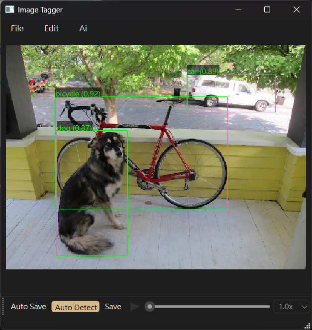

本專案可對影像畫框  
可用於object detection的影像訓練dataset  

功能一覽
- 滾輪可預覽上/下一個檔案
- 預設label種類名稱[設定檔](./config/label.yaml), 按下數字鍵可以直接切換label名稱, 或者按下小寫的`L`來設定指定名稱
  以減少輸入次數

## 雜談
PyQt最棒的地方在於, 畫面上可以直接打中文

### 關於video播放
Google AI Gemini-2.0-pro 跟我都試過了, 沒有辦法把video widget的frame傳到畫布中編輯  
因此用傳統的方式來把frame轉成pixmap  
PyQt6真的是做了很多很多餘的事, 像是按下某元件, 所有按鍵都會只對該元件作用  
原本設定好的快捷鍵全失效  