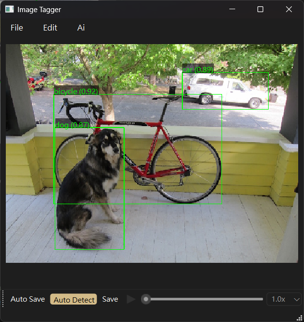

# Image Tagger

對影像、影片畫框 (BBox / Polygon)，產出 object detection 或 segmentation 的訓練 dataset。
支援 Ultralytics YOLO / SAM3 自動偵測，並可將 VOC 標註轉為 YOLO 格式。



## 安裝環境與啟動

> 詳細安裝步驟請見 [安裝指南](./docs/installation.md)

```bash
# 安裝完畢後直接啟動
python main.py
```

## 基本使用流程

```
開啟資料夾 → AI 自動偵測 (或手動畫框) → 儲存 VOC XML → 轉成 YOLO 格式 → 訓練模型
```

1. **File → Open Folder** 開啟含有圖片的資料夾
2. **按 `d` 或 Ai → Detect** 偵測物件（首次會自動下載 `yolo26s.pt` 預設模型）
3. 手動微調框的位置、名稱後，**File → Save** 或按 `s` 儲存為 VOC XML
4. **Convert → Edit Categories** 設定 class_name → class_id 的對應關係, 才能給yolo訓練(因為yolo只認數字)
5. **Convert → VOC to YOLO** 選擇資料夾 → 設定輸出模式與 train/val 比例 → 自動轉換、分割檔案並產生 `dataset.yaml`
6. 使用產生的 `dataset.yaml` 訓練模型, 路徑剛好對應dataset的圖檔與標籤

> 每個步驟的詳細操作說明請見 [使用教學](./docs/usage.md)
> 訓練相關（dataset 結構、data.yaml、segment 訓練）請見 [訓練指南](./docs/training.md)

## 功能總覽

| 功能 | 說明 |
|------|------|
| YOLO 自動偵測 | 載入 `.pt` 模型，偵測並畫框 |
| SAM3 語義分割 | 透過文字描述自動產生 polygon / bbox |
| 手動 BBox | 左鍵拖曳畫框，角落可調整大小 |
| 手動 Polygon | 左鍵點擊頂點，靠近起點自動封閉 |
| Mask 工具 | Draw / Erase / Fill 遮罩繪製，但訓練不需要 |
| VOC → YOLO 轉換 | 支援 BBox、Seg、OBB 三種輸出格式，轉換進度條、未對應 class 記錄 |
| Categorize Media | 用 YOLO/SAM3 模型偵測後，依最多次物件名稱自動分類到子資料夾 |
| 影片標註 | 逐幀標註，支援自動抽幀儲存 |

## 快捷鍵

| 按鍵 | 功能 |
|------|------|
| `q` | 離開 |
| `s` | 儲存 |
| `a` | 切換 Auto Save |
| `d` | 執行偵測 (Detect) |
| `l` | 編輯選取框的 label 名稱 |
| `v` | Select 選取模式 |
| `b` | BBox 繪製模式 |
| `p` | Polygon 繪製模式 |
| `數字鍵` | 快速切換預設 label（支援多碼，如 `12`、`111`） |
| `Esc` | 取消正在繪製的 BBox / Polygon |
| `PgUp/PgDn` 或 `←/→` | 上/下一個檔案 |
| `Home/End` | 第一個/最後一個檔案 |
| `Space` | 影片 Play/Pause |
| 滾輪 | 預覽上/下一個檔案 |

## 設定檔

| 檔案 | 用途 |
|------|------|
| `cfg/system.yaml` | 系統設定：預設 label、啟用 SAM3/Mask/OBB 等開關 |
| `cfg/settings.yaml` | 執行期設定：模型路徑、categories 對應、text prompts. 不存在時會自動生成 |

## 常用vs code的快捷組合鍵

- ctrl + shift + `: 開新terminal(e.g. git bash, command prompt)
- ctrl + d: focus在terminal的話, 關閉目前的terminal
- f5: run python程式
- shift + f5: 關閉目前正在跑的python程式
- ctrl + shift + f5: 如果有正在跑的python程式, 則關掉並重跑
- ctrl + `+`: 放大文字
- ctrl + `-`: 縮小文字

## 更新

2026/4/9
- system.yaml可設定各種數字對應的class_name, 並且可在system.yaml設定短編碼的反應時間
- VOC轉yolo格式時, 可在選定資料夾後選擇轉換的方式, 例如train/val的比例
- SAM3 影片 frame bug 修正 — infer_sam3 改為接收 cv_img (numpy array)，不再傳檔案路徑。這樣影片的每一幀都能正確被 SAM3 偵測。
- Ai → SAM3 Output Mode... dialog — 可在 seg / bbox / all 三種模式間切換，設定會存入 settings.yaml。

2026/4/11
- VOC → YOLO 轉換增加進度條、未對應 class_name 記錄檔 (not_match_*.txt)、轉換完成摘要對話框
- Ai → Categorize Media — 選擇資料夾與 model，自動偵測每個圖片/影片中出現最多次的物件，依名稱分類到子資料夾。支援 YOLO / YOLO-Seg / SAM3 三種模型，可自動偵測模型類型。

## 文件目錄

- [安裝指南](./docs/installation.md) — 環境建置、PyTorch CUDA、常見問題排除
- [使用教學](./docs/usage.md) — 各項功能的詳細操作方式
- [訓練指南](./docs/training.md) — 從標註到訓練 YOLO 模型的完整流程
