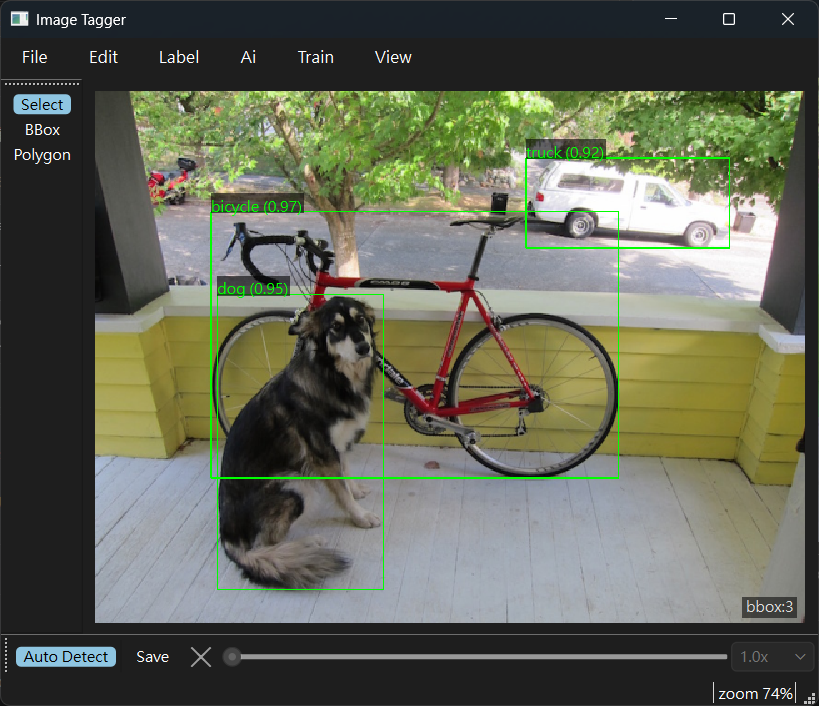

# Image Tagger

對影像、影片畫框 (BBox / Polygon)，產出 object detection 或 segmentation 的訓練 dataset。
支援 Ultralytics YOLO / SAM3 自動偵測，並可將 VOC 標註轉為 YOLO 格式。



## 安裝環境與啟動

> 詳細安裝步驟請見 [安裝指南](./docs/installation.md)

**建議使用 [uv](https://docs.astral.sh/uv/)**：安裝套件快，且會依 `pyproject.toml` 自動裝好含 **CUDA 13.0** 的 PyTorch。

```bash
# 保持 uv 為最新版（本專案需 uv >= 0.12）
uv self update

# 建立環境並安裝所有相依（含 CUDA 13.0 的 PyTorch）
uv sync

# 啟動
uv run main.py
```

> **請定期更新 uv。** uv 改版頻繁，舊版遇到 PyTorch index 的邊緣狀況時，錯誤訊息往往指向錯誤的原因（例如把「index 沒發布 hash」報成 `Hash mismatch`）。`uv sync` 出現無法理解的相依錯誤時，先 `uv self update` 再試一次。細節見 [安裝指南](./docs/installation_uv.md#請保持-uv-為最新版)。

> **Fallback（不使用 uv 時）**：改用 Python 內建 venv + pip。注意 PyTorch CUDA 版要自行從 cu130 index 安裝，pip 不會讀取 `pyproject.toml` 裡的 uv index 設定。
>
> ```bash
> python -m venv .venv
> .venv\Scripts\Activate.ps1                                                    # Windows PowerShell
> pip install torch torchvision --index-url https://download.pytorch.org/whl/cu130
> pip install .
> python main.py
> ```

## 基本使用流程

```
開啟資料夾 → AI 自動偵測 (或手動畫框) → 儲存 VOC XML → 轉成 YOLO 格式 → 訓練模型
```

1. **File → Open Folder** 開啟含有圖片的資料夾
2. **Ai → Set YOLO Model** 設定模型路徑與 Confidence 門檻（首次會自動下載 `yolo26s.pt` 預設模型）；如需使用 SAM3，透過 **Ai → Set SAM3 Model** 一併設定模型、Confidence、輸出模式、Polygon Tolerance 與 Text Prompts
3. **按 `d` 或 Ai → Detect** 偵測物件
4. 手動微調框的位置、名稱後，**File → Save** 或按 `s` 儲存為 VOC XML
5. **Train → VOC to YOLO** 在對話框中設定 Class Mapping（class_name → class_id）、選擇資料夾、輸出模式與 train/val 比例（預設 80/20）→ 自動轉換並產生 `dataset.yaml`
6. **Train → Train YOLO** 直接在 GUI 內訓練：選擇 `dataset.yaml`、Task（Detect / Segment）、Model Size、訓練參數，啟動後顯示 epoch 進度與 mAP，完成後可開啟訓練資料夾。也可指定既有 `.pt` 接續訓練（Resume / Fine-tune）

> 每個步驟的詳細操作說明請見 [使用教學](./docs/usage.md)
> 訓練相關（dataset 結構、data.yaml、segment 訓練）請見 [訓練指南](./docs/training.md)

## 功能總覽

| 功能 | 說明 |
|------|------|
| YOLO 自動偵測 | 載入 `.pt` 模型，支援 detect 與 seg model；seg model 可輸出 bbox / polygon / all。信心值門檻、輸出模式、polygon 精細度都在 Set YOLO Model 裡調 |
| SAM3 語義分割 | 透過文字描述自動產生 polygon / bbox；Set SAM3 Model 整合模型、信心值門檻、輸出模式、tolerance、prompts |
| 手動 BBox | 左鍵拖曳畫框，角落可調整大小 |
| 手動 Polygon | 左鍵點擊頂點，靠近起點自動封閉 |
| Cropped 裁切儲存 | 只裁切有框的區域存成小圖 + VOC XML（Label → Label Mode），每個框外擴 padding 或補至 640、碰邊往對邊補；相鄰框自動合併，適合小物件 ROI dataset |
| Mask 工具 | Draw / Erase / Fill 遮罩繪製，但訓練不需要 |
| VOC → YOLO 轉換 | 支援 BBox、Seg、OBB 三種輸出格式，轉換進度條、未對應 class 記錄 |
| Train YOLO (GUI) | 直接在 GUI 內呼叫 ultralytics 訓練，可設定基本參數與進階參數（優化器 / 增強 / cache 等），訓練中顯示進度與 mAP；支援指定既有 `.pt` 做 Resume / Fine-tune 再訓練 |
| Categorize Media | 用 YOLO/SAM3 模型偵測後，依最多次物件名稱自動分類到子資料夾 |
| 影片標註 | 逐幀標註，支援自動抽幀儲存；狀態列顯示 `frame 目前幀 / 總幀數` |
| 縮放與平移 | 滾輪以游標為錨點縮放、中鍵/右鍵拖曳平移、`f` 還原檢視；換到同尺寸的影像會保留縮放位置，方便逐張比對同一區域 |
| 標註調整 | 選取中的框有 8 個控制點：四角一次改兩個方向，四邊只改單一方向；拖框內整體移動 |
| 邊界限制 | 畫面上的框與多邊形一律留在影像內（畫新框、resize、移動、偵測結果、讀進來的 XML 都會處理）；OBB 旋轉框例外 |
| Undo / Redo | 標註的畫框、移動、resize、旋轉、頂點拖曳、刪除、改 label、執行偵測都可還原（`Ctrl+Z`），每張影像各自計算 |
| 刪除圖片與標籤 | 把畫錯的圖與同名 XML 成對丟到資源回收筒（File → Delete Image & Label），刪除前跳視窗確認 |

## 快捷鍵

| 按鍵 | 功能 |
|------|------|
| `q` | 離開 |
| `s` | 儲存（整張圖模式下沒有框時等同存背景樣本）|
| `a` | 切換 Auto Save — 讓沒動過手、只有偵測結果的圖也落檔（需先開啟 Auto Detect；手動動過的標註本來就會存）|
| `d` | 執行偵測 (Detect) |
| `l` | 編輯選取框的 label 名稱 |
| `v` | Select 選取模式 |
| `b` | BBox 繪製模式 |
| `p` | Polygon 繪製模式 |
| `數字鍵` | 快速切換預設 label（支援多碼，如 `12`、`111`） |
| `Esc` | 取消正在繪製的 BBox / Polygon；沒有繪製中時取消選取 |
| `Delete` | 刪除選取的標註（Select 模式）|
| `Ctrl+Delete` | 把目前的圖片與同名 XML 一起丟到資源回收筒（需確認）|
| `Ctrl+Z` | 還原上一步標註變更（換檔後歸零）|
| `Ctrl+Shift+Z` / `Ctrl+Y` | 重做被還原的標註變更 |
| `PgUp/PgDn` | 上/下一個檔案 |
| `←/→` | 影片快退/快進 3 秒 |
| `Home/End` | 第一個/最後一個檔案 |
| `Space` | 影片 Play/Pause |
| `f` | 還原檢視（整張影像可見並置中）|
| 滾輪 | 以游標為錨點縮放 |
| `Ctrl` + 滾輪 | 上/下一個檔案 |
| 中鍵拖曳 / 右鍵拖曳 | 平移畫面 |

## 設定檔

| 檔案 | 用途 |
|------|------|
| `cfg/system.yaml` | 系統設定：預設 label、undo 步數上限、啟用 SAM3/Mask/OBB 等開關 |
| `cfg/settings.yaml` | 執行期設定：模型路徑、categories 對應、text prompts、訓練參數暫存 (training 區段)、標註儲存模式 (label 區段). 不存在時會自動生成 |

## 常用vs code的快捷組合鍵

- ctrl + shift + `: 開新terminal(e.g. git bash, command prompt)
- ctrl + d: focus在terminal的話, 關閉目前的terminal
- f5: run python程式
- shift + f5: 關閉目前正在跑的python程式
- ctrl + shift + f5: 如果有正在跑的python程式, 則關掉並重跑
- ctrl + `+`: 放大文字
- ctrl + `-`: 縮小文字

## 更新

歷次版本更新與功能異動請見 [更新記錄](./docs/changelog.md)。

## 文件目錄

- [安裝指南](./docs/installation.md) — 環境建置、PyTorch CUDA、常見問題排除
- [使用教學](./docs/usage.md) — 各項功能的詳細操作方式
- [訓練指南](./docs/training.md) — 從標註到訓練 YOLO 模型的完整流程
- [更新記錄](./docs/changelog.md) — 版本更新與功能異動歷程
