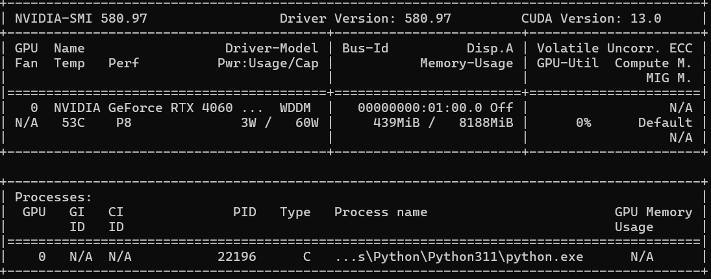

# 安裝指南

## 環境需求

- Python >= 3.12
- 建議使用獨立的虛擬環境（venv 或 uv）
- 有 NVIDIA 顯卡可大幅加速推論

## 安裝步驟

### 1. 安裝 PyTorch CUDA 版

> **重要**：PyTorch 的 CUDA 版必須**最先安裝**，否則後續套件可能自動裝入 CPU 版，導致推論極慢。

先到 [PyTorch 官網](https://pytorch.org/get-started/locally/) 查看你的 NVIDIA driver 支援的 CUDA 版本，選擇**不超過該版本**的 PyTorch 即可。

```bash
# 範例：CUDA 12.4
pip3 install torch torchvision torchaudio --index-url https://download.pytorch.org/whl/cu124
```

> 如果之前已裝過 PyTorch，建議**全部移除**再重裝（特別注意 `torchvision` 容易被遺漏）。
> 最保險的作法是開一個全新的虛擬環境。

### 2. 安裝其他相依套件

```bash
pip install -r requirements.txt
```

### 3. Linux 額外相依

如果 PyQt6 出現錯誤：
```bash
sudo apt-get install -y libxcb-cursor-dev
```

### 4. 驗證安裝

```bash
python tools/cuda_info.py
```

正常輸出應該像這樣：
```
torch version: 2.10.0+cu126
cuda available: True
cuda version: 12.6
cudnn version: 91002
```

確認重點：
- `torch version` 結尾要有 `+cuXXX`，**不是** `+cpu`
- `cuda available` 必須是 `True`

## GPU 沒有被使用？

如果推論時只有 1-2 FPS，代表沒有用到 GPU。以下是排查步驟：

### 確認 VRAM 有被佔用

在終端機執行：
```bash
nvidia-smi
```



- 右上角 `CUDA Version` 是你的 driver 支援的**最高** CUDA 版本
- 下方表格的 Memory Usage 在載入模型後應該有幾百 MB 以上的佔用
- 如果推論時 VRAM 完全沒增加，代表模型跑在 CPU 上

### 常見原因：torch 被降級為 CPU 版

安裝或升級某個套件時（尤其用了 `-U` flag），可能會把 `torch` 換成 CPU 版。

檢查方式：
```bash
pip list | grep torch
```

如果版本號沒有 `+cuXXX` 後綴，就是 CPU 版。解決方式：

```bash
pip uninstall torch torchvision torchaudio -y
pip3 install torch torchvision torchaudio --index-url https://download.pytorch.org/whl/cu124
```
