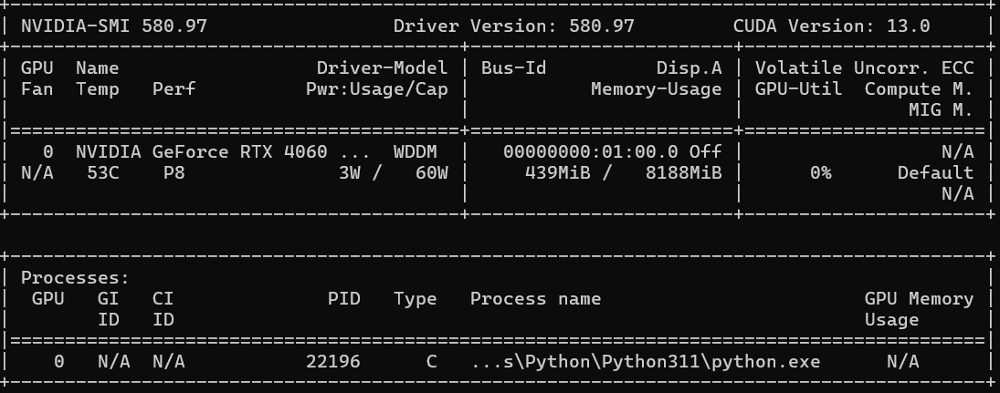

# 安裝指南

<!-- 最後更新：2026-08-21 -->

本專案以 **uv** 管理相依。所有套件（含 CUDA 13.0 的 PyTorch）都寫在 `pyproject.toml`、版本鎖在 `uv.lock`，`uv sync` 一行就會建立 `.venv` 並裝好全部。

## 環境需求

- **uv >= 0.12**，並建議定期 `uv self update`（原因見 [請保持 uv 為最新版](#請保持-uv-為最新版)）
- Python >= 3.12 — 不必事先裝好，`uv sync` 會依 `.python-version` 自行準備
- 系統可用的 **`git`**：SAM3 用的 `clip` 只發佈在 GitHub 上，`uv sync` 要靠 git 把它 clone 下來
- NVIDIA driver 需支援 **CUDA 13.0** 以上（PyTorch 從 cu130 index 安裝）
- 有 NVIDIA 顯卡可大幅加速推論

> **為什麼不提供 pip / venv 的步驟**
>
> 專案的直接相依全部用 `==` 釘死、間接相依鎖在 `uv.lock`，而 `pip install .` 既讀不到 lock，也不讀 `[tool.uv.sources]` —— SAM3 的 `clip` 就是靠那段指向 ultralytics 的 GitHub fork（PyPI 上那個同名套件是無關的剪貼板工具，最新版停在 2013 年）。所以 pip 不但裝不出可重現的環境，還會在找不到 `clip==1.0` 時整個失敗。
>
> 真的無法使用 uv 時，可自行參照 `pyproject.toml` 手動安裝，順序是：先從 cu130 index 裝 `torch` / `torchvision` → `pip install git+https://github.com/ultralytics/CLIP.git` → `pip install .`。這條路徑不在維護範圍內。

## 1. 安裝 uv

如果尚未安裝 uv，請先安裝：

```bash
# Windows (PowerShell)
powershell -ExecutionPolicy ByPass -c "irm https://astral.sh/uv/install.ps1 | iex"

# Linux / macOS
curl -LsSf https://astral.sh/uv/install.sh | sh
```

> 安裝完成後重新開啟終端，確認 `uv --version` 有正確輸出。

### 請保持 uv 為最新版

**本專案需要 uv >= 0.12**，且建議養成定期更新的習慣：

```bash
uv self update
```

> 若 uv 是用其他方式安裝的（如 pipx、Homebrew、scoop），`uv self update` 會失效，請改用原本的管道更新。

uv 改版很快（每一兩週就有新版），而 PyTorch 這類套件的 index 又常有邊緣狀況，**舊版 uv 的錯誤訊息經常無法反映真正的原因**。實際遇過的例子：

- PyTorch cu130 index 沒有發布 `torchvision` Windows wheel 的 `#sha256`（Linux wheel 則正常）。uv <= 0.7.x 遇到這種缺 hash 的 wheel，會退而拿下載檔去比對該版本「其他平台」的 hash，於是必然 mismatch，報出 `Hash mismatch for torchvision==...`，看起來像檔案損毀或 CDN 有問題，實際上檔案完全正常。升到 uv 0.12.1 後即正常安裝。

所以 **`uv sync` 出現無法理解的相依 / hash 錯誤時，第一步先更新 uv 再試一次**，通常比去改 `pyproject.toml` 有效。

## 2. 安裝所有相依

在專案根目錄執行：

```bash
uv sync
```

`uv sync` 會：

- 依 `.python-version`（3.12）建立 `.venv`
- 從 PyTorch 官方 cu130 index 安裝含 CUDA 13.0 的 `torch` / `torchvision`
- 從 PyPI 安裝其餘相依（ultralytics、PyQt6、opencv-python…）
- 從 GitHub clone 並安裝 `clip`（SAM3 的 text encoder，PyPI 上沒有），因此**需要系統可用的 `git`**

> PyTorch cu130 相依較大，首次安裝需要一些時間。
>
> cu130 是給 NVIDIA driver 支援 CUDA 13.0（含以上）的環境。若你的 driver 較舊，請到 [PyTorch 官網](https://pytorch.org/get-started/locally/) 查看可用的 CUDA 版本，並將 `pyproject.toml` 中 `[[tool.uv.index]]` 的 `url` 改成對應版本（例如 `.../whl/cu124`）後再 `uv sync`。

> `uv sync` 會移除所有不在 `uv.lock` 內的套件。因此不要用 pip 手動往 `.venv` 裡加東西 —— 下次 sync 就會被清掉。需要新套件請寫進 `pyproject.toml`。

## 3. 啟動程式

```bash
uv run main.py
```

> `uv run` 會自動使用專案的 `.venv`，不需手動 activate。
> 如果偏好手動啟動，仍可 `.venv\Scripts\Activate.ps1`（Windows）/ `source .venv/bin/activate`（Linux）後直接 `python main.py`。

## 4. Linux 額外相依

如果 PyQt6 出現錯誤：
```bash
sudo apt-get install -y libxcb-cursor-dev
```

## 5. 驗證安裝

```bash
uv run scripts/cuda_info.py
```

正常輸出應該像這樣：
```
torch version: 2.13.0+cu130
cuda available: True
cuda version: 13.0
cudnn version: 92000
```

確認重點：
- `torch version` 結尾要有 `+cuXXX`，**不是** `+cpu`
- `cuda available` 必須是 `True`

## GPU 沒有被使用？

如果推論時只有 1-2 FPS，代表沒有用到 GPU。以下是排查步驟：

### 確認 VRAM 有被佔用

在終端機執行：
```bash
nvidia-smi
```



- 右上角 `CUDA Version` 是你的 driver 支援的**最高** CUDA 版本
- 下方表格的 Memory Usage 在載入模型後應該有幾百 MB 以上的佔用
- 如果推論時 VRAM 完全沒增加，代表模型跑在 CPU 上

### 常見原因：torch 被降級為 CPU 版

安裝或升級某個套件時（尤其用了 `-U` flag），可能會把 `torch` 換成 CPU 版。

檢查方式：
```bash
uv pip list | grep torch
```

如果版本號沒有 `+cuXXX` 後綴，就是 CPU 版。重新同步即可（`pyproject.toml` 已指定 cu130 index）：

```bash
uv sync --reinstall-package torch --reinstall-package torchvision
```
