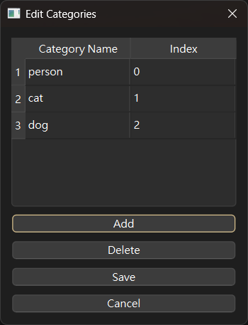

# 使用教學

## 啟動程式

```bash
python main.py
```

## 基本操作流程

```
開啟資料夾 → 偵測/畫框 → 調整標註 → 儲存 → 轉換格式
```

---

## 開啟檔案

- **File → Open Folder**：開啟一個含有圖片或影片的資料夾
- **File → Open File By Index**：跳到該資料夾中的第 N 個檔案
- **滾輪** 或 **PgUp/PgDn**：瀏覽上/下一個檔案
- **Home/End**：跳到第一個/最後一個檔案

> 狀態欄會顯示目前在第幾個檔案，以及總檔案數。

---

## AI 自動偵測

### YOLO 偵測

1. **Ai → Use default model**：自動下載 `yolov8n.pt` 預設模型（適合快速體驗）
2. **Ai → Select Model**：選擇自定義的 `.pt` 模型（必須是 Ultralytics 相容的模型）
3. **Ai → Detect**：對目前的影像執行偵測
4. **Ai → Auto Detect**（快捷鍵 `d`）：開啟後，切換檔案時自動偵測

> 如果圖片旁已有同名的 `.xml` 標籤檔且內含 bbox，Auto Detect 不會覆蓋，會優先使用 XML 的標註。

### SAM3 語義分割

> 需要先在 `cfg/system.yaml` 中設定 `enable_sam3: true`

1. **Ai → Select SAM3 Model**：選擇 SAM3 的 `.pt` 模型檔
2. **Ai → Use SAM3**：切換為 SAM3 模式
3. **Ai → Edit Text Prompts**：設定要偵測的類別名稱（如 person、cat、dog）
4. **Ai → Detect**：執行 SAM3 推論

SAM3 會根據文字描述自動產生 segmentation mask 並轉為 polygon。
在 `cfg/settings.yaml` 中可設定輸出模式：

| `sam3_label_mode` | 行為 |
|---|---|
| `seg` | 只產生 polygon（建議用於 segment 訓練） |
| `bbox` | 只產生 bounding box |
| `all` | 同時產生 polygon 和 bbox |

> 訓練 segment 時建議用 `seg` 模式，避免 `all` 模式在轉換時產生重複標註。

---

## 手動標註

### BBox 模式（快捷鍵 `b`）

- **左鍵拖曳**：畫出矩形框
- 畫好後，框的角落可以拖曳調整大小
- Focus 中的框會暫時變黃色
- **右鍵**：刪除滑鼠位置下的框（後畫的優先刪除）

### Polygon 模式（快捷鍵 `p`）

- **左鍵點擊**：新增頂點
- 靠近第一個頂點時自動封閉多邊形
- **右鍵**：繪製中取消當前多邊形，或刪除已有的多邊形

### Select 模式（快捷鍵 `v`）

- 用於選取、移動已有的標註
- 右鍵功能與對應模式相同

### Mask 工具

> 需要先在 `cfg/system.yaml` 中設定 `enable_mask_tools: true`

- **Draw**：筆刷繪製遮罩
- **Erase**：擦除遮罩
- **Fill**：填充封閉區域
- 筆刷大小可透過滑桿調整（1-100 px）

---

## Label 管理

- **`L` 鍵**：彈出視窗，輸入自定義 label 名稱（只影響最後 focus 的框）
- **數字鍵 `0-9`**：快速套用預設 label（在 `cfg/system.yaml` 的 `labels` 區段設定）
- 按下數字鍵後，狀態欄會顯示對應的 label 名稱

---

## 儲存

- **File → Save**（快捷鍵 `s`）：將標註儲存為 VOC XML 格式
- **File → Auto Save**（快捷鍵 `a`）：切換檔案時自動儲存

> 儲存的圖片和 XML 會放在原始資料夾下的 `output` 子資料夾，避免與原始檔案混淆。
> 如果 Mask 工具有啟用，mask 會另存為 `{檔名}_mask.png`。

---

## VOC → YOLO 轉換

1. **Convert → Edit Categories**：設定 class name 到數字編號的對應

   

   例如 `person → 0`、`cat → 1`、`dog → 2`。
   同一個物件的不同名稱可以對到同一個編號（如 `motor`、`motorbike`、`motorcycle` 都對到 `9`）。

2. **Convert → Settings**：選擇輸出模式

   | 模式 | YOLO 格式 | 用途 |
   |------|-----------|------|
   | BBox | `class_id cx cy w h` | Object Detection 訓練 |
   | Seg | `class_id x1 y1 x2 y2 ... xN yN` | Segmentation 訓練 |
   | OBB | `class_id x1 y1 x2 y2 x3 y3 x4 y4` | 旋轉框偵測（目前停用） |

3. **Convert → VOC to YOLO**：批次轉換所有 XML 為 YOLO `.txt`

> 所有座標值都是正規化（0~1）的相對座標。
> 轉換後的 `.txt` 檔會放在與 XML 相同的資料夾中。

---

## 影片標註

- 開啟含影片的資料夾後，程式會自動辨識影片格式
- **Space**：Play / Pause
- 有播放進度條，可拖曳跳轉
- 按下滑鼠鍵會暫停播放
- 開啟 Auto Save 後，播放期間會自動抽幀儲存，檔名為 `{原檔名}_frame{N}`
- 在 `cfg/system.yaml` 的 `auto_save_per_second` 可設定每幾秒儲存一幀（`-1` 關閉）
