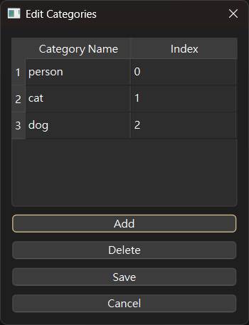

# 使用教學

## 啟動程式

```bash
python main.py
```

## 基本操作流程

```
開啟資料夾 → 偵測/畫框 → 調整標註 → 儲存 → 轉換格式 → 訓練
```

---

## 開啟檔案

- **File → Open Folder**：開啟一個含有圖片或影片的資料夾
- **File → Open File By Index**：跳到該資料夾中的第 N 個檔案
- **PgUp/PgDn** 或 **Ctrl + 滾輪**：瀏覽上/下一個檔案（單純滾輪已改為縮放）
- **Home/End**：跳到第一個/最後一個檔案

> 狀態欄會顯示目前在第幾個檔案，以及總檔案數。影片另外在右側常駐顯示
> `frame 目前幀 / 總幀數`，播放、拖動進度條、用 `←/→` 快退快進都會同步。

---

## AI 自動偵測

### YOLO 偵測

1. **快捷鍵 `d`** 或 **Ai → Detect**：對目前的影像執行偵測（首次會自動下載 `yolo26s.pt` 預設模型）
2. **Ai → Select YOLO Model**：選擇自定義的 `.pt` 模型（必須是 Ultralytics 相容的模型）
3. **Ai → Auto Detect**：開啟後，切換檔案時自動偵測

> 如果圖片旁已有同名的 `.xml` 標籤檔且內含 bbox，Auto Detect 不會覆蓋，會優先使用 XML 的標註。

### SAM3 語義分割

由於SAM3是需要申請下載權限, 因此請到  
https://huggingface.co/facebook/sam3  
有獲得授權後就能下載 `sam3.pt`

> 需要先在 `cfg/system.yaml` 中設定 `enable_sam3: true`

1. **Ai → Select SAM3 Model**：選擇 SAM3 的 `.pt` 模型檔
2. **Ai → Use SAM3**：切換為 SAM3 模式
3. **Ai → Edit Text Prompts**：設定要偵測的類別名稱（如 person、cat、dog）
4. **Ai → Detect**：執行 SAM3 推論

SAM3 會根據文字描述自動產生 segmentation mask 並轉為 polygon。
在 `cfg/settings.yaml` 中可設定輸出模式：

| `sam3_label_mode` | 行為 |
|---|---|
| `seg` | 只產生 polygon（建議用於 segment 訓練） |
| `bbox` | 只產生 bounding box |
| `all` | 同時產生 polygon 和 bbox |

> 訓練 segment 時建議用 `seg` 模式，避免 `all` 模式在轉換時產生重複標註。

---

## 縮放與平移

| 操作 | 動作 |
| ---- | ---- |
| 滾輪 | 以游標為錨點縮放（一格約 20%） |
| 中鍵拖曳 / 右鍵拖曳 | 平移畫面 |
| `f` | 還原檢視（整張影像可見並置中） |
| `Ctrl` + 滾輪 | 上/下一個檔案 |

狀態列右側常駐顯示目前的縮放倍率，`100%` 代表原圖 1 pixel 對 1 螢幕 pixel。

> 右鍵在畫布上只負責平移，沒有其他作用 —— 畫多邊形畫到一半誤點右鍵不會讓你重來。

規則：

- **換到尺寸相同的影像會保留縮放與位置**，逐張比對同一個區域時不必每張重新找一次；
  尺寸不同才重新還原檢視。
- 縮放下限是「還原檢視」倍率的 1/4，上限 40 倍；平移不會把影像拖出畫面外，
  影像比視窗小時自動置中。
- 標註座標永遠是**原圖像素**，縮放只影響顯示。放大後畫的框、拖的頂點都會換算回原圖，
  畫到一半縮放也不會錯位。
- 小物件標註建議先放大再畫：`minimal_bbox_length` 是以原圖像素判斷的，
  縮小顯示時畫出來的框很容易低於門檻而被丟掉。

---

## 手動標註

### BBox 模式（快捷鍵 `b`）

- **左鍵點兩下**：第一下定起點、第二下定對角，畫出矩形框
- Focus 中的框會暫時變黃色
- **Esc**：取消正在繪製的框
- 調整已有的框請切到 **Select 模式**（`v`）

> 右鍵在畫布上**只負責平移**，不刪除標註、也不取消繪製。
> 刪除一律走 Select 模式選取後按 `Delete`（而且可以 `Ctrl+Z` 救回來）；
> 取消繪製一律走 `Esc`。

### Polygon 模式（快捷鍵 `p`）

- **左鍵點擊**：新增頂點
- 靠近第一個頂點時自動封閉多邊形
- **Esc**：取消正在繪製的多邊形
- 畫到一半可以用右鍵拖曳平移、滾輪縮放，已放下的頂點不會跑掉

### Select 模式（快捷鍵 `v`）

用於選取與修改已有的標註。

| 操作 | 動作 |
| ---- | ---- |
| 左鍵點標註 | 選取 |
| 拖標註內部 | 整體移動（不變形） |
| 拖角落控制點 | 同時改兩個方向的大小（**只有選取中的框才有控制點**） |
| 拖上下左右控制點 | 只改單一方向的大小 |
| 拖旋轉握把 | 旋轉（需 `enable_obb: true`） |
| 拖 polygon 頂點 | 改形狀（頂點優先於整體移動） |
| 拖空白處 | 框選多個標註 |
| `Delete` | 刪除選取的標註 |
| `L` / 數字鍵 | 改選取標註的 label |
| `Esc` | 取消選取 |

多選：

- **拖空白處**框選（bbox 只要與框選範圍相交、polygon 只要有頂點落在範圍內）；
  拖曳中會顯示框選範圍的 `寬x高=面積`（原圖像素）
- 選取中的標註畫成黃色
- **拖任一個已選取的標註 → 整批一起移動**，相對位置不變，選取狀態也不會被打散；
  點到**未**選取的標註則改為單選那一個
- `Delete` 一次刪完；`L` 或數字鍵一次改掉所有選取項的 label
- 整批移動與整批刪除都只算**一步** `Ctrl+Z`

移動的邊界處理：拖到影像邊緣就停住。多選時是**整組一起夾**——碰到邊界時整組
停下，不會出現「碰到的那幾個停住、其他繼續走」而把相對位置弄散。

選取中的框有 **8 個控制點**：四個角一次改兩個方向，四個邊只改單一方向
（上/下只改高、左右只改寬），不必為了改一邊而小心翼翼地對齊另一邊。

- 邊控制點在**該方向的畫面長度塞不下「角-邊-角」三個方塊時會自動不出現**，
  否則邊的中點會跟兩個角疊在一起，想拖角卻拖到邊。所以很小的框、或縮小檢視時，
  只會看到四個角 —— 放大就會出現。
- 角落與邊的熱區在角附近會重疊，**角落優先**，不會出現想拉兩個方向卻只拉到一個。
- 旋轉過的框（`enable_obb: true`）也是 8 個控制點，邊控制點沿**旋轉後**的軸調整。
- 拖過對邊時框會**翻到另一側**，不會產生負的寬高。

> **控制點只屬於選取中的框。** 控制點本來就只畫給選取中的框，熱區跟著限縮才不會
> 出現「看不到卻踩得到」——框重疊時最容易誤把旁邊那個拖變形。代價是要先點選再拖。

### 標註不會超出影像

畫面上的框與多邊形一律留在影像範圍內，不論它是怎麼來的：

| 來源 | 處理 |
| ---- | ---- |
| 畫新框 / 加多邊形頂點 | 起點與終點在記錄時就夾住，所以拖曳中的預覽與最後建出來的框一致 |
| 拖控制點改大小 | 游標先夾進影像再算邊界，游標不出界框就不出界 |
| 拖著移動 | 夾位移量，框不會變形；多選整組一起夾 |
| 執行偵測 | 偵測結果偶爾會溢出邊界，載入後一併裁回來 |
| 讀進來的 `.xml` | 同樣裁回來 —— 畫面上不該出現超出影像的框，不管檔案裡寫的是什麼 |

兩個刻意的取捨：

- **超出的部分是「裁掉」而不是「整個平移回來」。** 框超出邊界通常代表物體被影像
  邊緣截斷，裁掉溢出的部分後框仍貼著看得到的那一半；平移的話框會整個跑離物體。
  只有**移動操作**是平移（夾位移量），因為拖曳中的框不該變形。
- **旋轉過的框（OBB）不受這個限制。** 貼著邊緣的斜物體，它的四個角本來就會落在
  影像外，硬夾回來會連帶改變角度或讓框變形，那種標註就畫不出來了。

> 讀檔時的裁切**不會**把檔案標記成待存 —— 只是翻過去看一眼就改動檔案不合理。
> 一旦真的動過標註，存檔時寫出去的自然就是裁過的值。

### Mask 工具

> 需要先在 `cfg/system.yaml` 中設定 `enable_mask_tools: true`

- **Draw**：筆刷繪製遮罩
- **Erase**：擦除遮罩
- **Fill**：填充封閉區域
- 筆刷大小可透過滑桿調整（1-100 px）

---

## Undo / Redo

- **`Ctrl+Z`**：還原上一步標註變更
- **`Ctrl+Shift+Z`** 或 **`Ctrl+Y`**：重做

可還原的動作包含畫框、畫多邊形、**移動**（含多選整批移動）、resize、旋轉、
拖曳多邊形頂點、刪除（含多選一次刪多個）、改 label，以及**執行偵測**
——`d` 會把現有標註整批換成偵測結果，誤按時用 `Ctrl+Z` 救回來。

規則：

- 歷史屬於**目前這張影像**，切換檔案或影片換幀時歸零。換檔會重讀該檔的 `.xml`，
  留著上一張的歷史會讓 undo 把別張圖的框寫進這一張。
- 步數上限由 `cfg/system.yaml` 的 `undo_limit` 決定（預設 60），超過就丟掉最舊的一步。
- 沒有真的改到東西不會佔用步數：點一下選取但沒拖動、點到 resize 控制點卻沒拖動、
  拖出去又拖回原位、畫的框小於 `minimal_bbox_length`、套用了相同的 label，
  都不會留下按了沒反應的空步驟。
- 還原本身也算一次變更，切換檔案時會把還原後的結果寫回 `.xml`。
- Mask 工具（Draw / Erase / Fill）不在 undo 範圍內。

---

## Label 管理

- **`L` 鍵**：彈出視窗，輸入自定義 label 名稱（影響選取中的標註；多選時會一次套用到全部，預設值取第一個）
- **數字鍵**：快速套用預設 label（在 `cfg/system.yaml` 的 `labels` 區段設定）
  - 支援多碼輸入（如 `1`、`12`、`111`），可對應超過 10 個類別
  - 若輸入的碼唯一且無歧義，會立即套用
  - 若碼是其他更長碼的前綴（如 `1` 和 `12` 同時存在），會等待 `label_key_timeout` 秒後套用
  - 輸入過程中，狀態欄會顯示目前已輸入的碼

### Labels 快捷鍵設定

在 `cfg/system.yaml` 的 `labels` 區段以 `數字碼: 標籤名稱` 的格式定義，例如：

```yaml
labels:
  # --- 1x 哺乳類(大型) ---
  1: deer
  11: bear
  12: boar
  # --- 2x 哺乳類(中型) ---
  2: monkey
  21: dog
  # --- 0 未分類 ---
  0: unknown
```

- **編碼規則**：首碼代表大類，次碼代表子類，建議以樹狀結構分組
- **前綴衝突**：若 `1` 和 `12` 同時存在，按下 `1` 後系統會等待 `label_key_timeout`（預設 2 秒）再套用，讓你有時間繼續輸入 `12`；而 `12` 因為沒有更長的前綴碼，會立即套用
- **`label_key_timeout`**：在 `cfg/system.yaml` 中可調整等待秒數，熟練後建議降低以加快操作速度

---

## 儲存

- **File → Save**（快捷鍵 `s`）：依目前的**儲存模式**儲存標註。整張圖模式下即使畫面沒有任何框也會儲存（寫出空標註 XML），因此**要收背景樣本就是清掉框後按 `s`**；Cropped 模式沒有框則不儲存
- **Ai → Auto Save**（快捷鍵 `a`）：自動儲存 Auto Detect 的偵測結果與影片抽幀。**需先開啟 Auto Detect 才可勾選**，關閉 Auto Detect 時會一併關閉

> 手動畫的框不需要開啟 Auto Save：只要動過標註（畫框 / 拖曳 / 刪除），切換檔案、滾輪換圖、播放影片、關閉程式時都會自動儲存。Auto Save 只負責「自動產生」的標註落檔。

> 儲存的圖片和 XML 會放在原始資料夾下的 `output` 子資料夾，避免與原始檔案混淆。
> 如果 Mask 工具有啟用，mask 會另存為 `{檔名}_mask.png`。

輸出位置由 `cfg/system.yaml` 的 `save_folder` 決定，設成絕對路徑（如 `D:/output`）時會忽略目前資料夾，一律輸出到該處。此時若**直接開啟 `save_folder` 本身**回頭修標籤，來源與輸出就是同一個檔案：

- **整張圖模式**：跳過複製圖片，直接覆寫原本的 XML，等同原地更新標註（把框全部刪掉再存也會寫成空 XML）
- **Cropped 模式**：會拒絕儲存並在狀態列提示。因為裁切每次都產生新檔名，原地裁切會不斷疊加（`a_crop0` → `a_crop0_crop0`）；要改這批圖的標籤請切到整張圖模式，或把 `save_folder` 指到別的資料夾

### 儲存模式（Label → Label Mode…）

透過 **Label → Label Mode…** 對話框切換兩種模式（此選單原名 `Edit`）：

| 模式 | 行為 | 使用情境 |
|------|------|----------|
| 整張圖（預設） | 儲存整張影像 + 標註 (VOC XML)，即使沒有任何框也會存（可作為訓練背景 / 負樣本） | 一般 YOLO 偵測 / 分割 dataset，物件在畫面中的大小與比例接近實際部署場景 |
| Cropped 裁切 | 只裁切「有框」的區域，各自存成小圖 + 標註 (VOC XML)；沒有任何框則**不儲存** | 對動態區 / ROI 過濾後的目標做放大裁切，讓小物件在 YOLO 輸入維度 (如 640) 下佔比更大，提升小目標偵測訓練效果 |

Cropped 模式的裁切尺寸為**二選一**：

| 尺寸模式 | 說明 |
|----------|------|
| 固定外擴 padding | 每個框四周各外擴指定 pixel，增加背景資訊 |
| 至少固定尺寸 | 裁切區至少為指定邊長（預設 `640`，對齊 YOLO 輸入維度），置中於框；框比該尺寸更大時取框尺寸 |

- 外擴過程若某一邊已達影像邊緣沒有像素，會**往對邊補足像素**以維持裁切尺寸
- 相鄰、能落在同一裁切區內的多個框會**合併**成一張（含多個標籤），避免重複裁切
- **bbox 與 polygon 都會處理**，座標會自動平移到裁切圖的座標系
- 輸出檔名為 `{原檔名}_crop{N}.jpg` / `.xml`（影片再加上 `_frame{N}`），存放位置與整張圖模式相同 (`output` 子資料夾)
- 輸出資料夾與目前開啟的資料夾相同時會**拒絕儲存**，避免裁切結果被反覆裁切疊加

> 產出的 VOC XML 與整張圖模式相同格式，可直接沿用 **Train → VOC to YOLO** 轉成 YOLO dataset。
> Cropped 相關設定會存入 `cfg/settings.yaml` 的 `label` 區段。

---

## 刪除畫錯的圖與標籤

**File → Delete Image & Label**（快捷鍵 `Ctrl+Delete`）：把目前的圖片與同名 `.xml` **成對**丟到資源回收筒。

- 刪除前會跳出視窗列出所有將被刪除的檔名與所在位置，**預設按鈕是「No」**，避免順手按 Enter 就刪掉
- 走**資源回收筒**而非永久刪除，誤刪可以還原
- 只處理目前開啟的資料夾，**不會**去動 `save_folder` 裡的輸出；要清掉已輸出的那一份，請直接開啟 `save_folder` 再刪
- 沒有對應 `.xml` 的圖片也能刪（只刪圖片），視窗會註明
- Mask 工具啟用時，同名的 `_mask.png` 會一併刪除
- 刪除後自動顯示原本的下一張；刪到最後一張則退回前一張，資料夾清空則畫面留白
- **影片不支援刪除**（一個影片是整批素材的來源，標註存的是抽出的幀，沒有成對可言），請直接在檔案總管處理

> `Delete` 與 `Ctrl+Delete` 是兩件事：`Delete` 只刪畫面上選取的標註框，`Ctrl+Delete` 才是刪檔案。刻意分開，就是為了不要想刪一個框卻誤刪整張圖。

---

## VOC → YOLO 轉換

1. **Train → VOC to YOLO**：選擇含 VOC XML 的資料夾後，會彈出設定對話框：

   - **Class Mapping**：在對話框內按「編輯 Mapping」設定 class name 到數字編號的對應，例如 `person → 0`、`cat → 1`、`dog → 2`。同一個物件的不同名稱可以對到同一個編號（如 `motor`、`motorbike`、`motorcycle` 都對到 `9`）。

     

   - **輸出模式**：

     | 模式 | YOLO 格式 | 用途 |
     |------|-----------|------|
     | BBox | `class_id cx cy w h` | Object Detection 訓練 |
     | Seg | `class_id x1 y1 x2 y2 ... xN yN` | Segmentation 訓練 |
     | OBB | `class_id x1 y1 x2 y2 x3 y3 x4 y4` | 旋轉框偵測（目前停用） |

   - **Train / Val 比例**：預設 80%/20%，可調整（Train 最少 50%）；若設為 100% 不產生 val set，產出的 `dataset.yaml` 仍會把 `val` 退回指向 `train` 以滿足 ultralytics 規範

   轉換完成後，工具會自動：
   - 將圖片和標籤依比例移動到 `images/train`、`images/val` 和 `labels/train`、`labels/val`
   - 在資料夾根目錄產生 `dataset_YYYY_MMDD_HHMMSS.yaml`，可直接用於 Ultralytics 訓練

> 所有座標值都是正規化（0~1）的相對座標。

---

## Train YOLO（GUI 內訓練）

**Train → Train YOLO** 直接在 GUI 內呼叫 ultralytics 訓練，不必再切到終端機跑 Python script。

### 基本流程

1. 選擇 `dataset.yaml`（會自動帶上次用過的；或從上一步 VOC → YOLO 產出的資料夾自動搜尋最新的 `dataset_*.yaml`）
2. 設定 **Task**（Detect / Segment）、**Model Size**（n/s/m/l/x）、**Version**（預設 `yolo26`）
   - 對話框下方會顯示組合出的最終模型檔名，例如 `yolo26s.pt` 或 `yolo26m-seg.pt`，本地不存在時 ultralytics 會自動下載
3. 設定基本訓練參數：

   | 參數 | 說明 |
   |------|------|
   | Epochs | 最大訓練輪數，搭配 Patience 提前停止 |
   | Batch | 每批次圖片數；`-1` = 自動偵測最大 batch |
   | Image Size | 輸入解析度（px），常見 320 / 640 / 1280 |
   | Patience | 連續 N epoch mAP 無改善則停止；0 = 關閉 |
   | Device | `0` = 第一張 GPU；`cpu`；`0,1` = 多卡 |
   | Save Period | 每 N epoch 額外存 checkpoint；-1 = 關閉 |
   | Name | 輸出資料夾名（runs/<task>/<name>/），留空自動帶時間戳 |

4. 按「**開始訓練**」後狀態列會顯示 `Epoch X/Y  mAP50=…`，並在 epoch 結束時更新進度條
5. 訓練中可按「**停止**」優雅地在當前 epoch 結束後中止
6. 訓練完成後下方顯示輸出資料夾、訓練時間、Box / Seg 的 mAP@0.5、mAP@0.5:0.95
7. 「**開啟訓練資料夾**」會用檔案總管打開 `runs/<task>/<name>/`（含 best.pt、last.pt、訓練曲線圖）

### 進階參數

按「**進階參數...**」開啟分頁式對話框，可細調以下類別：

| 分頁 | 內容 |
|------|------|
| 優化器 | optimizer / lr0 / lrf / weight_decay / warmup_epochs / warmup_momentum |
| 幾何 / 翻轉 | degrees / translate / scale / perspective / flipud / fliplr |
| 色彩 | hsv_h / hsv_s / hsv_v |
| 混合增強 | mosaic / close_mosaic / mixup / copy_paste |
| 系統 | workers / cache (false/ram/disk) / rect / amp / fraction / freeze |

> 所有基本與進階參數都會暫存在 `cfg/settings.yaml` 的 `training` 區段，下次再開直接帶回上次的值。
> 各參數意義可懸停滑鼠看 tooltip，或參考 [Ultralytics Train 官方文件](https://docs.ultralytics.com/modes/train/)。

---

## 影片標註

- 開啟含影片的資料夾後，程式會自動辨識影片格式
- **Space**：Play / Pause
- 有播放進度條，可拖曳跳轉
- 按下滑鼠鍵會暫停播放
- 開啟 Auto Save 後，播放期間會自動抽幀儲存，檔名為 `{原檔名}_frame{N}`（Auto Save 需先開啟 Auto Detect）
- 在 `cfg/system.yaml` 的 `auto_save_per_second` 可設定每幾秒儲存一幀（`-1` 關閉）
